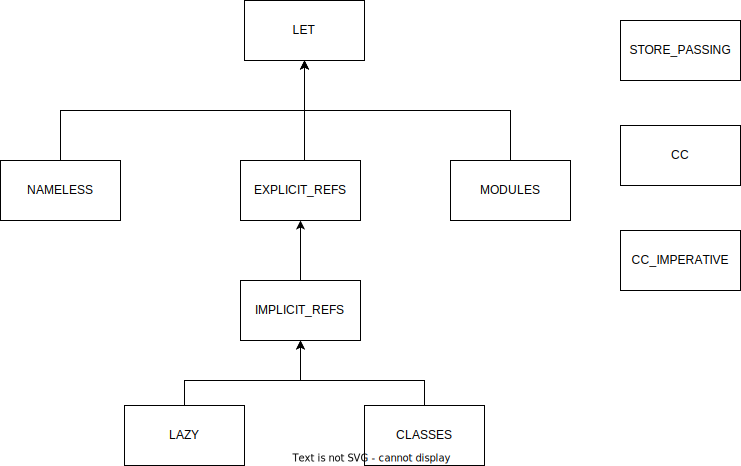

# Essential of Programming Languages
The programs require Python Lex-Yacc library to run. You may get the library from https://www.dabeaz.com/ply/.

As for current state, I'm not working on it.

# Note
1. By convention,
   ```
   <token>(...)
   ```
   is implemented outside of the target language.
   ```
   (operator ...)
   ```
   is reserved for user-defined procedure.
2. Derived Form 
   ---
   Expression that expand to other expressions. The idea can be generalized to marco in Scheme. Reference : [The Scheme Programming Language, 4th Edition](https://www.scheme.com/tspl4/further.html#./further:h1).
   
   It allows a smaller implementation. Example usage is that `let` expression is defined in term of `procedure`, then if implemented the semantic of `procedure`, then `let` automatically follow. 
   
   Another example, the `conditional` 
    ```scheme
    (cond ((< x 0) (- x))
          ((= x 0) 0)
          (else x))
    ```
    can be rewritten in form using `branch` to
    ```scheme
    (if (< x 0)
        (- x)
        (if (= x 0)
            0
            x))
    ```
3. Although expansion of derived form can be interleaved to parsing stage, implementer prefers to seperate them into 2 steps. So that parsing only return uninterpreted AST. It is the task of interpreter to give it meaning. 
  
    It might be tempting to seperate expansion process from `value_of` function. The reason of not seperating these is that put all behaviour definition in the same function, even they are derived. This is to document these together.
    
    However, expansion has the problem that we cannot easily to know the expected behaviour of program from the expansions itself. This requires additional documentation.
4. Interpreter Inheritance. Inspired by [IU Compiler Course - Essential of Compilation](https://github.com/IUCompilerCourse/Essentials-of-Compilation). The textbook wrote a section how OOP make the compiler extensible. 
    
    There 2 ways to exploit OOP in developing extensible interpreters : inheritance and forwarding. Though there is workaround if you do not resolve to use OOP. The example is included at [./note/extensible_interpreter.ipynb]()

    Why some prefer does not use Python's inheritance and `super`? Personally, foward instance to other class give you more control than using `super`.

   ```python
   class Let_Interpreter:
        def value_of(self,expr,env):
            value_of = self.value_of
            if ...:
                return value_of(exp,env)
            else:
                raise Exception

   class Nameless_Let_Interpreter:
        def value_of(self,expr,env):
                if ...
                else:
                    return Let_Interpreter.value_of(self,expr,nameless_env)
   ```
   
   **interpreter inheritance**
   ---
   

   **checker inheritance**
   ---
   
